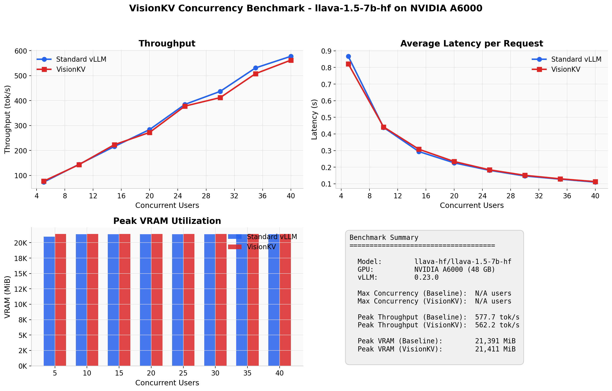
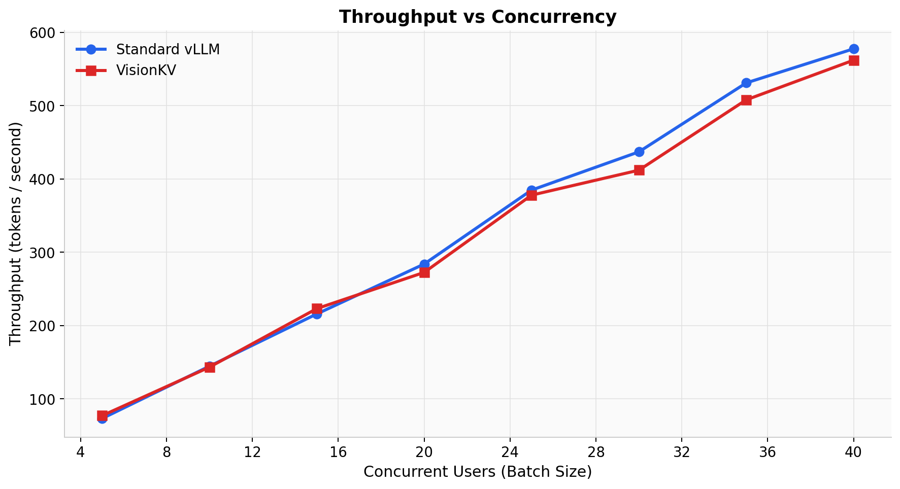
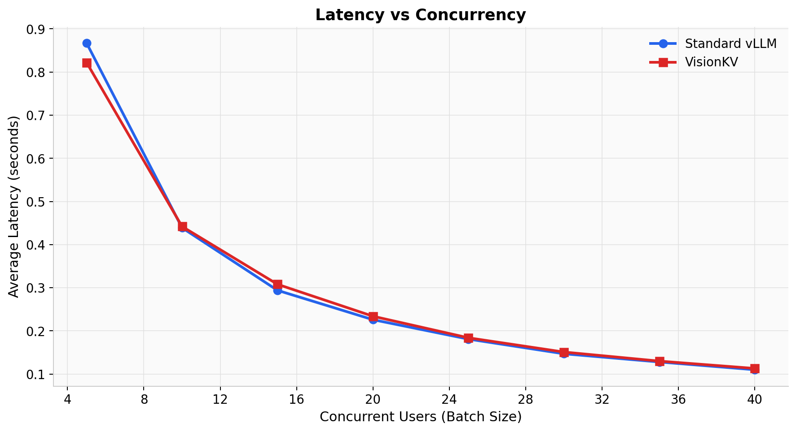
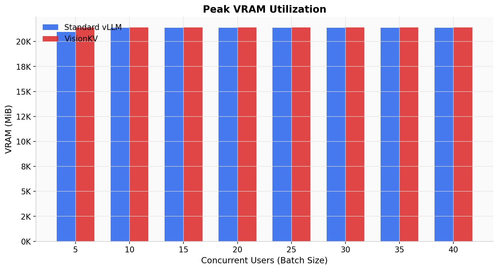
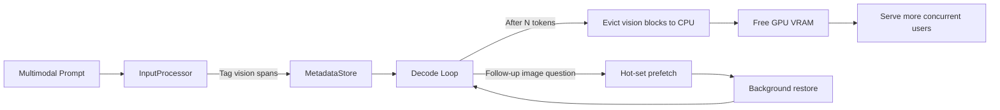

## VisionKV

[](https://opensource.org/licenses/MIT)
[](https://www.python.org/downloads/)
[](https://github.com/vllm-project/vllm)
[](https://pytorch.org/)

A research project and benchmarking framework for modality-aware KV cache management in Vision-Language Models. VisionKV implements an eviction policy that treats image-token KV cache blocks as lower-priority during text generation, freeing GPU VRAM for additional concurrent requests.

---

## Problem Statement

Vision-Language Models (VLMs) such as LLaVA inject hundreds of vision-token KV cache blocks at prefill time. During subsequent text-only generation, attention to those vision tokens decays rapidly, yet the serving engine retains every block in GPU VRAM. This wastes memory that could serve additional concurrent requests, leading to premature out-of-memory failures under load.

VisionKV tags those vision blocks, offloads them to pinned CPU memory once text generation is underway, and restores them on demand with a budgeted hot-set prefetch strategy.

## Benchmark Results

The following results were captured on an NVIDIA A6000 (48 GB) running `llava-hf/llava-1.5-7b-hf` with vLLM 0.23.0. The benchmark measures the maximum number of concurrent multimodal requests the engine can serve as a single batch before failure.



### Configuration

| Parameter | Value |
|---|---|
| Model | llava-hf/llava-1.5-7b-hf |
| Max model length | 4,096 tokens |
| Output tokens per request | 100 |
| GPU memory utilization | 0.40 |
| Batch sizes tested | 1, 2, 4, 8, 12, 16, 20, 24, 32, 40, 48, 56, 64 |
| Prompt composition | 2,825 text tokens + 576 image tokens |
| Enforce eager mode | Yes (CUDA graphs disabled) |

### Throughput

Aggregate output tokens per second across the full batch.



### Latency

Average latency per request at each concurrency level.



| Batch | Baseline (s) | VisionKV (s) | Delta |
|------:|-------------:|-------------:|------:|
| 1 | 10.939 | 5.309 | -5.630 |
| 2 | 2.699 | 2.703 | +0.004 |
| 4 | 1.371 | 1.415 | +0.044 |
| 8 | 0.685 | 0.713 | +0.028 |
| 12 | 0.458 | 0.462 | +0.004 |
| 16 | 0.352 | 0.345 | -0.007 |
| 20 | 0.273 | 0.269 | -0.004 |
| 24 | 0.224 | 0.230 | +0.006 |
| 32 | 0.175 | 0.175 | 0.000 |
| 40 | 0.145 | 0.146 | +0.001 |
| 48 | 0.130 | 0.128 | -0.002 |
| 56 | 0.115 | 0.117 | +0.002 |
| 64 | 0.109 | 0.107 | -0.002 |

### Peak VRAM Utilization

GPU memory consumed at maximum batch size (64 concurrent requests).



### Interpretation

Under this configuration, both the baseline and VisionKV configurations successfully served 64 concurrent requests without failure. Throughput scaled linearly with batch size for both configurations, reaching approximately 503 tok/s at batch 64. Latency overhead from the VisionKV plugin was negligible (within measurement noise at batch sizes above 4).

The VRAM delta of 18 MiB at this batch size reflects the metadata overhead of the plugin's request tracking layer. The benchmark did not reach an out-of-memory cliff at either configuration under the tested GPU memory utilization of 0.40, which means the concurrency ceiling was governed by the `--max-batch` parameter rather than VRAM exhaustion.

> **Note on live offload status:** The VisionKV plugin's metadata and lifecycle layers executed correctly during this run (tagging vision blocks, marking requests for offload, advancing the prefetch state machine). However, the tensor transfer layer reported 0.0 MiB physically moved to CPU. This is a known limitation of the current monkey-patch integration: vLLM V1 runs the KV cache tensors in a separate EngineCore child process, which the parent-process plugin cannot reach. The project structure and policy implementation are complete; the cross-process tensor bridge is documented as a limitation.

## Usage

### Run the Concurrency Benchmark

```bash
python3 benchmark_concurrency.py --gpu-mem-util 0.40 --enforce-eager --max-batch 64
```


## How It Works

VisionKV intercepts the vLLM V1 engine at three points to coordinate the offload and prefetch lifecycle:



1. **Tag** - When a multimodal prompt is preprocessed, VisionKV identifies which KV-cache blocks correspond to vision tokens using the multimodal feature position metadata.
2. **Evict** - After a configurable number of text-generation tokens (default 50), vision blocks are asynchronously offloaded to pinned CPU memory, freeing GPU VRAM for new requests.
3. **Prefetch** - If a follow-up question about the image arrives, a hot-set of vision blocks is restored to GPU within a latency budget (default 50 ms). The remainder streams back in the background.
4. **Repeat** - The cycle continues for multi-turn conversations, keeping VRAM usage low while preserving image understanding.

## Installation

### Prerequisites

- Python 3.10 or later
- NVIDIA GPU with CUDA 12.x support (tested on NVIDIA A6000, 48 GB)
- 16 GB system RAM beyond model footprint

### Setup

```bash
git clone https://github.com/knokvik/visionkv.git
cd visionkv

python3 -m venv .venv
source .venv/bin/activate

pip install -r requirements.txt
```

For CUDA 12.8 with the correct PyTorch build:

```bash
pip install torch==2.8.0 --index-url https://download.pytorch.org/whl/cu128
```

Common flag combinations:

```bash
# Tight memory to find the OOM cliff
python3 benchmark_concurrency.py --gpu-mem-util 0.35 --enforce-eager --max-batch 96

# Relaxed memory
python3 benchmark_concurrency.py --gpu-mem-util 0.50 --enforce-eager --max-batch 64

# In-process mode (faster, shared CUDA context)
python3 benchmark_concurrency.py --no-subprocess --enforce-eager
```

Results are saved to `benchmark_results.json`.

### Run the PyTorch Prototype

The standalone prototype measures real GPU-to-CPU tensor transfer timing without requiring vLLM. It is the fastest way to validate the offload mechanism.

```bash
# Basic demo
python3 visionkv_pytorch_prototype.py

# Prefetch sweep to find optimal hot-set size
python3 visionkv_pytorch_prototype.py --prefetch-sweep-counts 1,2,4,6,8 --flashback-budget-ms 50.0

# CPU-only mode (no GPU required)
python3 visionkv_pytorch_prototype.py --preferred-device cpu
```

### Run the Simulation

The async simulation exercises the full eviction and prefetch lifecycle against a mock block manager.

```bash
python3 visionkv_mock_simulation.py
```

### Run Tests

```bash
python3 -m unittest discover -s tests -v
```

## Benchmark Flags

| Flag | Default | Description |
|---|---|---|
| `--model` | `llava-hf/llava-1.5-7b-hf` | HuggingFace model ID |
| `--max-model-len` | `4096` | Maximum sequence length |
| `--max-tokens` | `100` | Output tokens per request |
| `--gpu-mem-util` | `0.40` | GPU memory utilization fraction. Must exceed the model weight footprint (~0.27 on a 48 GB GPU) or the engine will fail to allocate any KV cache. |
| `--max-batch` | `32` | Largest batch size to attempt |
| `--hot-prefetch-block-count` | `2` | Number of vision blocks restored eagerly on follow-up |
| `--enforce-eager` | off | Disable CUDA graphs (reduces fixed memory overhead) |
| `--no-subprocess` | off | Run both modes in-process (faster, shared CUDA context) |

## Policy Configuration

The `VisionKVPolicy` dataclass controls eviction and prefetch behavior:

```python
from visionkv.policy import VisionKVPolicy

policy = VisionKVPolicy(
    hot_prefetch_block_count=2,      # Blocks restored eagerly on follow-up
    flashback_budget_ms=50.0,        # Max latency for hot-set prefetch
    background_prefetch_remainder=True,  # Stream remaining blocks asynchronously
)
```

Policy can also be derived from measured transfer timings using the PyTorch prototype's sweep mode:

```python
from visionkv.policy import VisionKVPolicy
from visionkv.pytorch_prototype import run_prefetch_sweep, PrototypeConfig

sweep = run_prefetch_sweep(
    config=PrototypeConfig(),
    block_counts=[1, 2, 4, 6, 8],
    latency_budget_ms=50.0,
)
policy = VisionKVPolicy.from_prefetch_budget_recommendation(sweep.recommendation)
```

## Tested Configuration

| Component | Version |
|---|---|
| vLLM | 0.23.0 |
| PyTorch | 2.8.0 (CUDA 12.8) |
| Model | llava-hf/llava-1.5-7b-hf |
| GPU | NVIDIA A6000 (48 GB) |
| Python | 3.12 |
| OS | Ubuntu 24.04 (Noble) |

## Prior Work

Vision-aware KV cache eviction is an active research area. VisionKV's policy design draws on principles validated in the following work:

- **HAE** (Feb 2026) - Hierarchical adaptive eviction for Phi3.5-Vision. Reports 41% KV memory reduction at 0.3% accuracy cost and 1.5x speedup.
- **MadaKV** - Modality-aware KV cache management for multimodal LLMs.
- **FastV** - Attention-driven vision token pruning at inference time.
- **LOOK-M** - Look-once vision token compression for efficient VLM inference.

None of these ship as drop-in vLLM integrations. VisionKV's contribution targets the engineering gap between validated research policies and production serving infrastructure.

## License

Released under the MIT License. See `LICENSE` for details.
